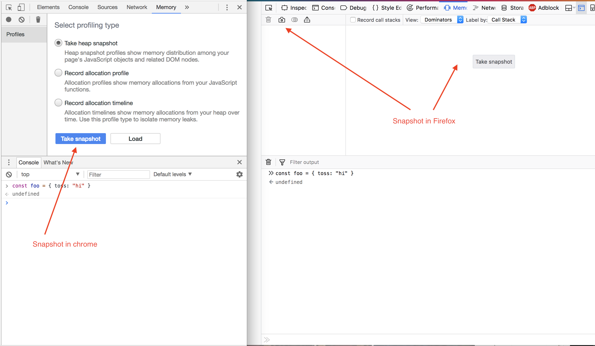
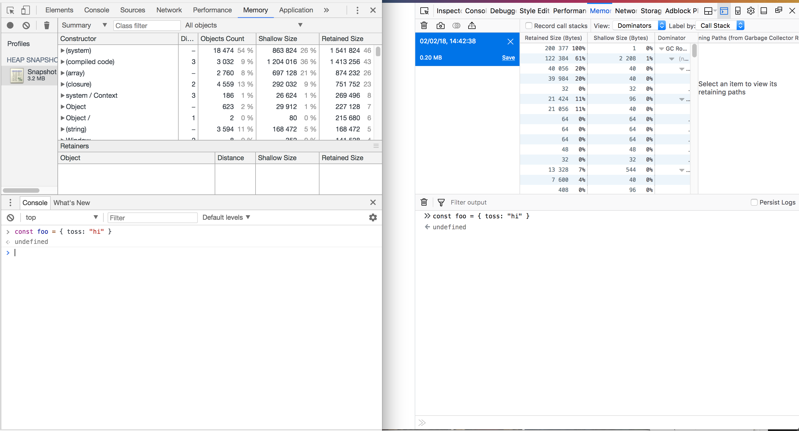
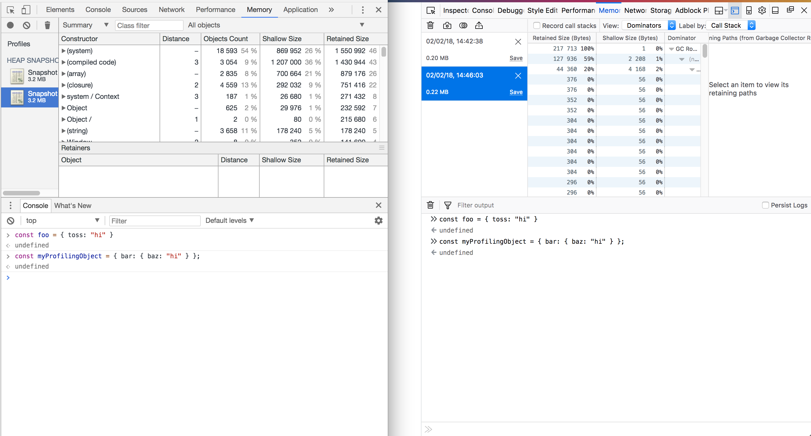
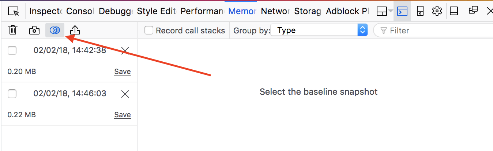
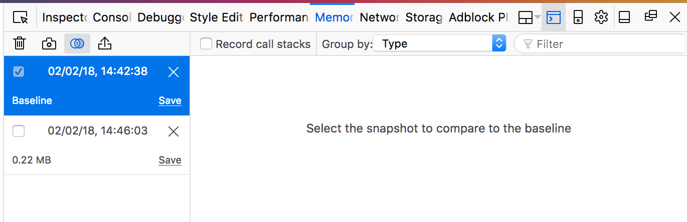
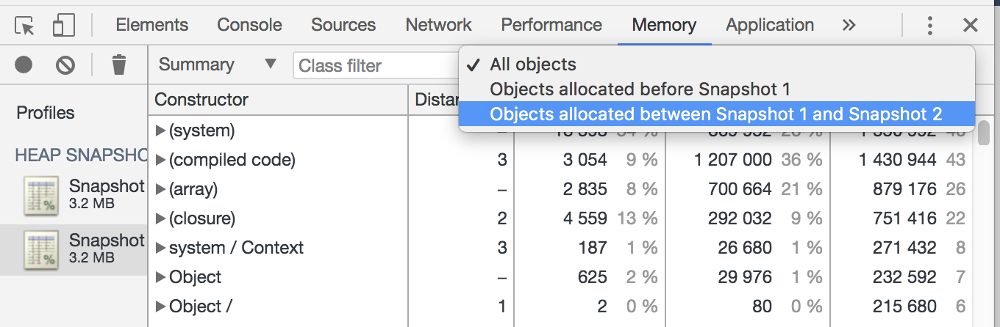
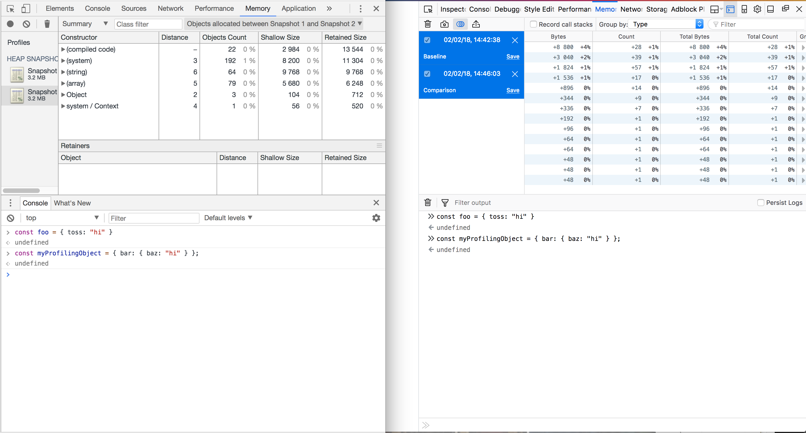
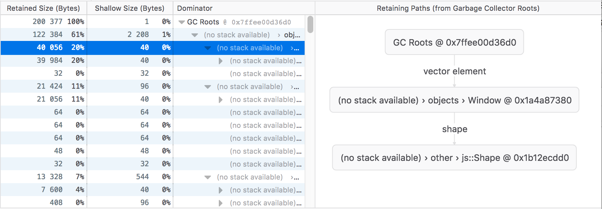

## February 1, 2018
# Tools for debugging Memory in JavaScript

(or rather, musings after reading the docs of chrome and firefox memory tools)

Yesterday I wrote a little about memory in JavaScript, and today I dug in a bit deeper into the docs. I had a few questions as I was reading and I've taken notes. That is pretty much what follows!


### Memory Terminology

Both Chrome and Firefox had some documentation of terminology, but Chrome's was more complete. Here
is what I gathered:

Basics:

* graph - a collection of nodes connected by edges. It can be circular, that means that two nodes
  can reference the same node.

* primitive - a JavaScript primitive, such as a number, boolean, string, undefined, null etc.

  In `const foo = { bar: { baz: "hi" } }`, `"hi"` is a primitive.

* node - an object, a piece of memory.

  In `const foo = { bar: { baz: "hi" } }`, `foo`, `bar`, and `baz` are nodes.

* edge - the connection between two nodes, a property or a reference. The following is chrome
  specific:

  In `const foo = { bar: { baz: "hi" } }`, `bar` is a reference to another object or data, and therefore an edge.

  If I understood correctly, chrome is simplifying the data a little so that you do not see more information than you need to,
  and has named edges after the properties that they point to while references have the names of the
  variables that they are assigned. This isn't the case with firefox, which makes it more difficult
  to understand what is going on, but is possibly a more accurate representation?

* dominators - an object that acts as an intermediary for other objects. For example, if an object
  is kept alive by a scope, then the scope is the dominator. In `const foo = { bar: { baz: "hi" } }`, `bar` is the dominator for `baz`. There is only on dominator for a given path. In `cont foo2 = { baz: foo, bar: foo}`, the dominator of `foo` is `foo2`, not `baz` or `bar`.

* heap - memory that has been allocated in no particular order.

Garbage Collector terms:

* Live or living nodes - nodes that are currently in use by the page or program
* GC - Garbage Collector
* GC Roots - the root node from which a garbage collector starts its search from for "living nodes".
  there is a representation of this in firefox, but not in chrome.

* Objects retaining tree is the tree built from the GC Roots and contains all "living" objects to
  represent one instance of the graph. This is chrome specific, but it looks like they have taken
  one specific path through the graph and represented it as a tree.

Size Terminology:

* shallow size - the size of the object itself. In `const foo = { bar: { baz: "hi" } }`, the shallow
  size of `baz` is 32 bits, because that is the size of the string "hi".
* retained size - the size of the object plus the objects that it keeps alive, In `const foo = { bar: { baz: "hi" } }`, the retained size of `bar` is 64 bits, because it is the cumulative size of `bar` and `baz` together. However, the cumulative size of `baz` is still 32, because it has no knowledge of `bar`. In other words, while the only reason `bar` exists is to contain a definition of `baz`, according to the graph, it is what is keeping alive `baz`, not the other way around.

You can find more information about terminology from both the [Chrome
docs](https://developers.google.com/web/tools/chrome-devtools/memory-problems/memory-101) and from
the [MDN docs](https://developer.mozilla.org/en-US/docs/Tools/Memory/Dominators).

### Basics of memory profiling

Regardless of which tools you use, the following can be done:

You can take `heap snapshots`. What this does is takes a picture of what the heap currently looks
like.

Let's use a blank page and take a snapshot before adding something in the console and after:
Navigate your browser to `data:,`:

Then, add the following to the console: `const foo = { toss: "hi" }`
Why do we do this? Because the first time you use the console, some new objects will be added to
memory, we don't want this noise in our profiling, so we are getting things started ahead of time.

You can take a heap snapshot via the main page in chrome, or from its profiles button,
while in firefox, you can take a heap snapshot from the main page of the memory tab, or from the snapshot
icon:




Now you can go ahead and take your first snapshot in the memory panel of the browser of your choice!



We can now add our test object in the console:

```javascript
const myProfilingObject = { bar: { baz: "hi" } };
```
And take another snapshot!



Now we can compare the two. In Firefox you do this with the compare
button, and select the baseline snapshot and the snapshot you want to compare





and in chrome, there is a dropdown to select which snapshot you want to compare



Here we can see the two comparisons that we get out of each browser. They both have a lot of
information and they are both different. For example chrome's is much more paired down and
organized, while Firefox shows you all of the roots and information about them.



A few notes: the tree view in firefox isn't very useful, and chrome has a few more tools than
firefox, such as recording memory usage over time -- however performance tools are also available!
remember that tools can be used together for great effect!

## January 31, 2018 - Understanding Memory in JavaScript

I had some nice feedback regarding yesterdays post. It wasn't clear what memory allocation was or
how it worked and I am going to explore that a bit! Also, lots of people use languages that have
garbage collection these days so I want to take a look into that topic, since how garbage collectors
actually work is new to me.

### Memory allocation and deallocation basics

Memory allocation refers to the process when you have a piece of data and you want to use it later .
For example, variable assignment frequently (but not always) results in a memory allocation.  This is a memory allocation in JavaScript:

```javascript
var myFunction = function() { return 0; };
```

This will allocate a number of bytes of memory to save this function (in this case 32 bytes!). The amount of memory allocated for
something might vary, and it depends on a number of factors. If you are interested in dynamic memory in
JS, there is some very good writing about it such as this [V8 blog post about dynamic
memory](https://moduscreate.com/blog/dynamic-memory-and-v8-with-javascript/).

Now that we have memory allocated, what happens when we don't need in any more. A program can't just
grow continuously in memory usage, as this would slow down the computer and eventually stop working!. If you are writing
JavaScript however, you usually forget about memory allocation. This is because JavaScript has garbage collection, which
is a process that keeps track of your memory usage and frees it regularly in relation to
whether or not that code is still in use, for example if there is still a reference to a block of
memory. Again taking JavaScript as an example:

```javascript
function myFunction() {
  var myString = "Hi"; // memory is allocated
};
// memory allocated for myString is out of scope, has no references and can be freed
```

In this example, every time we call `myFunction()`, `myString` will be allocated and deallocated
(freed)

In a language such as C, there is no garbage collector, and you are expected to free memory on your
own. You do allocation with `malloc` and deallocation with `free`. It looks something like this:

```c
#include <stdlib.h>

int main() {
        int *ptr = malloc(sizeof(int));
        if (!ptr)
              return 1;
        free(ptr);
        return 0;
}
```

For more details about how this works in JavaScript, check out the [MDN post about
Memory Management](https://developer.mozilla.org/en-US/docs/Web/JavaScript/Memory_Management)

### Tricky situations

You might be familiar with a couple of situations that are memory problems. These can be broken down
into three general categories: *Memory Leaks*, *Memory Bloat*, *frequent garbage collection*. The
chrome team has done a great job summarizing how to find and debug them in [their memory
documentation](https://developers.google.com/web/tools/chrome-devtools/memory-problems/), but to
summarize quickly:

* Memory leaks slow your page down over time, and are caused by memory being kept alive
  unnecessarily. These are not memory leaks in the conventional sense, instead they are
  what is referred to as "logical memory leaks". In other words, they are used somehow by the
  program, but that use is not important and the memory is being kept for no reason.
  For example, DOM nodes that are not displayed, event listeners for events that no
  longer happen, etc.

* Memory bloat occurs when you allocate a large amount of data that is persisted. This causes the
  page to be slow at all times

* Frequent Garbage collection's main symptom is the page seeming to pause on occasion. This occurs
  when a lot of objects are allocated, and then no longer in use.

The chrome team has also come up with a nice model for optimizing pages for performance and memory
usage, which you can find [here](https://developers.google.com/web/fundamentals/performance/rail)

### Understanding more about garbage collection

The garbage collector is a crucial part of how memory in JavaScript works. I will write more about
this at a future date, and link it here but for now I will summarize.

The garbage collector tracks memory allocation as it happens, and draws a tree of what is currently
in use, and what is not. If an object no longer has any links (references, contexts) to the current
context, then it can be treated as garbage. Garbage collection works a bit backwards from how you would expect, in that it tracks
what is currently "alive" and designates everything else as garbage ([ref for java, but similar idea](https://www.dynatrace.com/resources/ebooks/javabook/how-garbage-collection-works/)).

When a garbage collection cycle starts, it goes through all of the elements in the tree that are
currently "alive" and marks them to be kept. If something isn't in this tree, it is ignored, and
the memory that was used for it is marked as free. This is called a Mark and Sweep algorithm. Read
more about [garbage collection in js at
MDN](https://developer.mozilla.org/en-US/docs/Web/JavaScript/Memory_Management)

If you are curious to see how your program is building its GC root tree, you can use firefox memory
tool to take a look! In the memory tab, take a snapshot, and change the "view" from "tree view" to
"dominators", click on a node and you will see the following!



## January 30, 2018
Hi!

I was looking at the internet today, and found some pretty amazing things, got excited and wasn't too sure how to contain them all, and was honestly
swimming in a bit too much information.

SO, naturally, I kept reading around the internet, and started going through Julia Evans' posts at
[jvns.ca](jvns.ca). I had met her briefly at polyconf in 2016, the very first conference that I attended that
was a proper conference (the previous one being chaos communication camp which is pretty neat).
Anyway, Julia left a strong impression on me. Her talk was exciting, and incredibly informative. And
here I was, two years later, looking at her blog and thinking "I wish I could keep so much stuff in
my head".

I finally came to her blog post [about
writing](https://jvns.ca/blog/2016/05/22/how-do-you-write-blog-posts/), something that she started every day at the recurse
center in new york. Through this post I also found the blog of [Sumana](https://www.harihareswara.net/ces.shtml), who
also attended recurse and was writing a lot. What I realized is that all of this amazing writing was
a way of thinking too, so I am giving it a shot.

As a way to start I think I will try just writing what I learned about recently that I am really
excited about.

### How about Valgrind!
Valgrind is very exciting. It acts as an intermediate between your program and your CPU in order to
give you more information about your program than what your computer could provide by itself with
existing tools. It's a way of understanding what is happening with your memory in your
application. For example, if you are writing some C code that doesn't properly free memory, it will
tell you!

Here is an example C program that isn't doing quite what it should, it allocates memory with
`malloc` but it doesn't free it before it terminates!:

leaks.c
```c
#include <stdlib.h>

int main() {
        int *ptr = malloc(sizeof(int));
        if (!ptr)
              return 1;
        return 0;
}
```

If you aren't familiar with c, like me, we can compile our file using a compiler like gcc via `gcc -g
leaks.c`. The `-g` flag will tell the compiler to add symbolic debugger info, which helps debuggers
like Valgrind do what they do! This way, a debugger can tell you which source file and line number
have a problem, rather than just that there is a problem! This is my first program in C so it might
not be the best example but it illustrates what is going on 😅

With `gcc -g leaks.c` we will get a result called `a.out`.
Neat, so we have our buggy program. It compiles ok, and it also runs. But something is wrong. Let's
see what Valgrind has to say.

As mentioned above, Valgrind is sort of a virtual machine that runs your program and gives you back information that you don't
get from running the program on a regular system.

You can run valgrind like so:

`valgrind ./a.out`

And we will get this output:

```
==30352== Memcheck, a memory error detector
==30352== Copyright (C) 2002-2017, and GNU GPL'd, by Julian Seward et al.
==30352== Using Valgrind-3.13.0 and LibVEX; rerun with -h for copyright info
==30352== Command: ./a.out
==30352==
==30352==
==30352== HEAP SUMMARY:
==30352==     in use at exit: 4 bytes in 1 blocks
==30352==   total heap usage: 1 allocs, 0 frees, 4 bytes allocated
==30352==
==30352== LEAK SUMMARY:
==30352==    definitely lost: 4 bytes in 1 blocks
==30352==    indirectly lost: 0 bytes in 0 blocks
==30352==      possibly lost: 0 bytes in 0 blocks
==30352==    still reachable: 0 bytes in 0 blocks
==30352==         suppressed: 0 bytes in 0 blocks
==30352== Rerun with --leak-check=full to see details of leaked memory
==30352==
==30352== For counts of detected and suppressed errors, rerun with: -v
==30352== ERROR SUMMARY: 0 errors from 0 contexts (suppressed: 0 from 0)
```

This output doesn't seem entirely useful. It tells us which command we ran, and also that there was
1 allocation of 4 bytes that were definitely lost. We don't know where though, and what are all of
these numbers? (I asked, it is the process id, this info can be found
[here](http://valgrind.org/docs/manual/manual-core.html) at 2.3. This is a useful page)

But this message also gives a hint, at the bottom of the `LEAK SUMMARY`. We can rerun our command with `--leak-check=full` to see details

With that we get the following output:

```
==30434== Memcheck, a memory error detector
==30434== Copyright (C) 2002-2017, and GNU GPL'd, by Julian Seward et al.
==30434== Using Valgrind-3.13.0 and LibVEX; rerun with -h for copyright info
==30434== Command: ./a.out
==30434==
==30434==
==30434== HEAP SUMMARY:
==30434==     in use at exit: 4 bytes in 1 blocks
==30434==   total heap usage: 1 allocs, 0 frees, 4 bytes allocated
==30434==
==30434== 4 bytes in 1 blocks are definitely lost in loss record 1 of 1
==30434==    at 0x4C2FB0F: malloc (in /usr/lib/valgrind/vgpreload_memcheck-amd64-linux.so)
==30434==    by 0x10865B: main (leaks.c:4)
==30434==
==30434== LEAK SUMMARY:
==30434==    definitely lost: 4 bytes in 1 blocks
==30434==    indirectly lost: 0 bytes in 0 blocks
==30434==      possibly lost: 0 bytes in 0 blocks
==30434==    still reachable: 0 bytes in 0 blocks
==30434==         suppressed: 0 bytes in 0 blocks
==30434==
==30434== For counts of detected and suppressed errors, rerun with: -v
==30434== ERROR SUMMARY: 1 errors from 1 contexts (suppressed: 0 from 0)
```

Now we have some more information. The heap summary tells us that:

```
==30434== 4 bytes in 1 blocks are definitely lost in loss record 1 of 1
==30434==    at 0x4C2FB0F: malloc (in /usr/lib/valgrind/vgpreload_memcheck-amd64-linux.so)
==30434==    by 0x10865B: main (leaks.c:4)
```

Awesome. We not only know the file where the memory was allocated, we know the line. We even know the function (malloc allocated the memory, and it was done in main). AMAZING!

We now know how to fix our program. We need to free the memory after we used it, and before we
terminate our function. Probably close to where we use it. Here is an example.

leaks-fixed.c
```c
#include <stdlib.h>

int main() {
        int *ptr = malloc(sizeof(int));
        if (!ptr)
              return 1;
        free(ptr);
        return 0;
}
```

Then we can recompile it with `gcc -g leaks-fixed.c` and run it with `valgrind --leak-check=full
./a.out` to see the output:

```
==30525== Memcheck, a memory error detector
==30525== Copyright (C) 2002-2017, and GNU GPL'd, by Julian Seward et al.
==30525== Using Valgrind-3.13.0 and LibVEX; rerun with -h for copyright info
==30525== Command: ./a.out
==30525==
==30525==
==30525== HEAP SUMMARY:
==30525==     in use at exit: 0 bytes in 0 blocks
==30525==   total heap usage: 1 allocs, 1 frees, 4 bytes allocated
==30525==
==30525== All heap blocks were freed -- no leaks are possible
==30525==
==30525== For counts of detected and suppressed errors, rerun with: -v
==30525== ERROR SUMMARY: 0 errors from 0 contexts (suppressed: 0 from 0)
```

We can see in the heap summary that we have one allocation, and one freed instance of memory, with 4
bytes allocated in total. Perfect! Everything was freed, and there were no leaks. We fixed the
program!

Since C is a new language for me, you might have noticed that this program is a bit simplistic. For
example, does it matter that the memory wasn't freed? The program terminated immediately. And that
is true! This is a formality, but a good one to follow from what I understand. And let's see about a more complex example
debugging memory issues in the future as I get more familiar with both C and Valgrind :).

I didn't realize at the time, but you can use Valgrind when developing Firefox, and
that's how we get information about memory leaks! This is so neat, because now I can run my tests
with Valgrind directly! [Information on that can be found here](https://developer.mozilla.org/en-US/docs/Mozilla/Testing/Valgrind)


